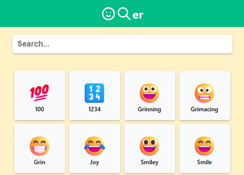

## ☺ Emoji App

Emoji App adalah aplikasi web sederhana yang menampilkan daftar emoji berdasarkan kata kunci pencarian. Dibuat menggunakan React dan mengambil data emoji dari JSON yang di-host di GitHub Pages. Klik emoji untuk langsung menyalinnya ke clipboard! 🫶

---

✨ Demo
🌐 [Live Demo](https://aglalrizal.github.io/emoji-app/)

---

📷 Preview


---

## 🔍 Fitur

🔎 Pencarian emoji real-time berdasarkan nama dan keyword

📋 Klik emoji untuk menyalin ke clipboard

⚡ Cepat, ringan, tanpa backend

💅 Styling modular dengan CSS Modules

📦 Data emoji diambil dari GitHub Pages (tanpa API eksternal)

---

## 🛠️ Teknologi

React
Vite
Axios
CSS Modules
Emoji data JSON (dari GitHub Pages)

---

## 🔗 Sumber Data Emoji

Data emoji diambil dari file JSON statis:
[📄 emojis.json](https://aglalrizal.github.io/emoji-data/data/emojis.json)

---

## 🚀 Jalankan Lokal

```bash
git clone https://github.com/aglalrizal/emoji-app.git
cd emoji-app
npm install
npm run dev
```

---

## 📤 Deploy

Aplikasi ini dideploy ke GitHub Pages dengan konfigurasi vite.config.js yang disesuaikan:

---
